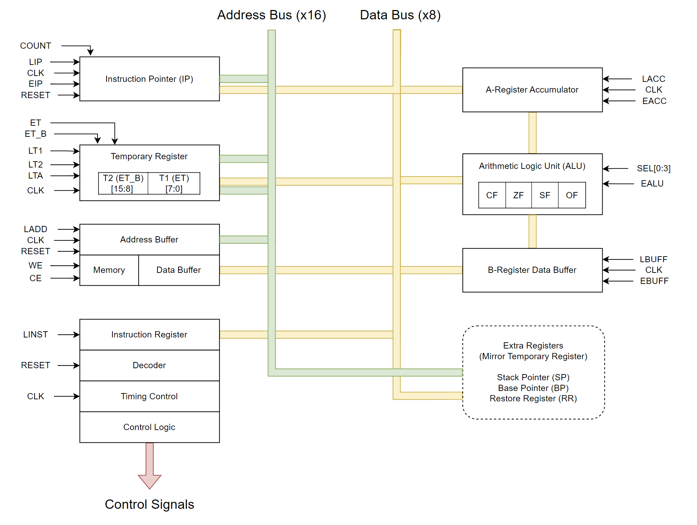

# CPU Architecture Reference Guide

## System Diagram

## Instruction Pointer
- Description: Holds the address of the instruction currently loaded.
- LIP: Load address bus to register.
- LIP1: Load data bus to lower 8 bits [7:0].
- LIP2: Load data bus to upper 8 bits [15:8].
- EIP: Output register to address bus and output lower 8 bits [7:0] to data bus.
- EIP_B: Output register to address bus and output upper 8 bits [15:8] to data bus.
- CLK: Increment IP by 1.

## Temporary Register
- Description: Holds temporary data to be used elsewhere in the current operation
- LT1: Load data bus to lower 8 bits [7:0].
- LT2: Load data bus to upper 8 bits [15:8].
- LTA: Load address bus to all 16 bits [15:0].
- ET: Output register to address bus and output lower 8 bits [7:0] to data bus.
- ET_B:  Output register to address bus and output upper 8 bits [15:8] to data bus.

## Address Buffer/Memory
- Description: RAM and ROM memory for CPU and associated buffers.
- LADD: Load address bus to address buffer.
- RESET: Reset address buffer to 0x00.
- WE: Write data bus to memory address in the address buffer.
- CE: Output memory at address in the address buffer to data bus.

## A and B Registers
- Description: Registers that feed the ALU.  A receives the output of the ALU.
- LACC/LBUFF: Load data bus to register.
- EACC/EBUFF: Write from register to data bus.

## Arithmetic Logic Unit (ALU)
- Description: Performs arithmetic and logic operations on data in A and B registers.  Result is stored in A.
- EALU: Write EALU register to data bus.
- CF: Carry Flag (CF) is set if result is incorrect for unsigned arithmetic.
- OF: Overflow Flag (OF) is set if result is incorrect for signed arithmetic.
- SF: Sign Flag (SF) is set if result is less than zero.
- ZF: Zero Flag (ZF) is set if result is equal to zero.

- SEL[0:3]: Select which arithmetic/logic operation will be performed, based on following table:
	
|SEL[0:3] | Operation | Result |
| --------- | ----------------- | -------------|
| 0x0 | Add | A + B |
| 0x1 | Subtract | A – B |
| 0x2 | Bit Shift Left | A << 1 |
| 0x3 | Bit Shift Right | A >> 1 |
| 0x4 | Increment A | A++ |
| 0x5 | Decrement A | A-- |
| 0x6 | Increment B | B++ |
| 0x7 | Decrement B | B-- |
| 0x8 | AND | A & B |
| 0x9 | OR | A | B |
| 0xA | XOR | A ^ B |
| 0xB | NOT A | ~A |
| 0xC | NOT B | ~B |
| 0xD | RESERVED |  |
| 0xE | RESERVED |  |
| 0xF | RESERVED |  |

## Instruction Register
- Description: Holds opcodes and operands for current instruction.  Performs all logic control flow for current instruction.  This is where most of the magic happens.
- LINST: Load data bus to register.
- RESET: Return all outputs and state variables to initial values.

## Stack Pointer
- Description: Holds the address of the next location to be pushed to the stack.
- LSP1: Load data bus to lower 8 bits [7:0].
- LSP2: Load data bus to upper 8 bits [15:8].
- LSPA: Load address bus to all 16 bits [15:0].
- ESP: Output register to address bus and output lower 8 bits [7:0] to data bus.
- ESP_B:  Output register to address bus and output upper 8 bits [15:8] to data bus.

## Base Pointer
- Description: Holds the address of the current base pointer.
- LBP1: Load data bus to lower 8 bits [7:0].
- LBP2: Load data bus to upper 8 bits [15:8].
- LBPA: Load address bus to all 16 bits [15:0].
- EBP: Output register to address bus and output lower 8 bits [7:0] to data bus.
- EBP_B:  Output register to address bus and output upper 8 bits [15:8] to data bus.

## Restore Register
- Description: Generally used to restore the A and B registers after CPU operations.
- LRR1: Load data bus to lower 8 bits [7:0].
- LRR2: Load data bus to upper 8 bits [15:8].
- LRRA: Load address bus to all 16 bits [15:0].
- ERR: Output register to address bus and output lower 8 bits [7:0] to data bus.
- ERR_B:  Output register to address bus and output upper 8 bits [15:8] to data bus.