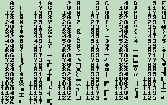
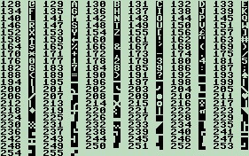

# Programming Reference Guide

<!-- TABLE OF CONTENTS -->

  
Table of Contents

  <ol>
    <li><a href="#compiler-keywords">Compiler Keywords</a></li>
    <li><a href="#instruction-set">Instruction Set</a></li>
    <li><a href="#memory-architecture">Memory Architecture</a></li>
    <li><a href="#stack-architecture">Stack Architecture</a></li>
    <li><a href="#screen-architecture">Screen Architecture</a></li>
  </ol>

## Compiler Keywords

### DEF
Syntax: DEF [value]

Defines a macro variable:
- Default: 8-bit
- *[value]: 16-bit memory address
- $[value]: 8-bit zero-page memory address

### STR
Syntax: STR "[string]"

Sets a series of values in OS constant memory region corresponding to character codes of the given string ended with a 00.

### SET
Syntax: SET [value]

Sets value in memory at CPU runtime.

### LOC
Syntax: LOC [label]

Marks a location in code for looping etc.

### FUNC
Syntax: FUNC [label]

Marks the start of a function.

## Instruction Set

  
<b>Memory Operations</b>

### MOV [Ar/Br] [MEM]

- Description: Move value at memory into A or B.
- Opcode: MOV && MEMA/MEMB (0x01/0x02)
- Clock cycles: 12
- Memory bytes: 3

### MOV [Ar/Br] &lt;immed>

- Description: Move immediate value into A or B.
- Opcode: MOV && IMMEDA/IMMEDB (0x03/0x04)
- Clock cycles: 8
- Memory bytes: 2

### MOV [MEM] [Ar/Br]

- Description: Move value in A or B into memory.
- Opcode: MOV && STORA/STORB (0x05/0x06)
- Clock cycles: 12
- Memory bytes: 3

### SWP

- Description: Swap A and B registers.
- Opcode: SWP && MOV (0x07)
- Clock cycles: 7
- Memory bytes: 1

### LDO [MEM]

- Description: Load into A from given address in MEM with offset in B.
- Opcode: MOV && SHL (0x08)
- Clock cycles: 18
- Memory bytes: 3

### STO [MEM]

- Description: Store A into given address in MEM with offset in B.
- Opcode: MOV && SHR (0x09)
- Clock cycles: 19
- Memory bytes: 3

### LDZ Ar

- Description: Load into A from zero-page pointer address in A with offset in B.
- Opcode: MOV && INCA (0x0C)
- Clock cycles: 16
- Memory bytes: 1

### LDZ [$ZP]

- Description: Load into A from given zero-page pointer address with offset in B.
- Opcode: MOV && DECA (0x0A)
- Clock cycles: 18
- Memory bytes: 2

### STZ [$ZP]

- Description: Store A into given zero-page pointer address with offset in B.
- Opcode: MOV && DECB (0x0B)
- Clock cycles: 19
- Memory bytes: 2

### IO [Ar/Br]

- Description: Print value of A/B register to console
- Opcode: IO && MEMA/MEMB (0x31/0x32)
- Clock cycles: 4
- Memory bytes: 1

  
<b>Stack Operations</b>

### PUSH Ar

- Description: Push A onto the stack and increment the stack pointer.
- Opcode: JMP && DECB (0x8B)
- Clock cycles: 13
- Memory bytes: 1

### PUSH &lt;immed>

- Description: Push the given value onto the stack and increment the stack pointer.
- Opcode: JMP && SWP (0x87)
- Clock cycles: 17
- Memory bytes: 2

### POP

- Description: Pop from the stack into A and decrement the stack pointer.
- Opcode: JMP && DECA (0x8A)
- Clock cycles: 12
- Memory bytes: 1

### PEEK Br

- Description: Load into A from the base pointer with the offset in B.
- Opcode: JMP && AUX (0x8E)
- Clock cycles: 16
- Memory bytes: 1

### PEEK &lt;immed>

- Description: Load into A from the base pointer with the given offset.
- Opcode: JMP && AUX (0x88)
- Clock cycles: 18
- Memory bytes: 2

### POKE Br

- Description: Store A into base pointer with the offset in B.
- Opcode: JMP && INCA (0x8C)
- Clock cycles: 14
- Memory bytes: 1

### POKE &lt;immed>

- Description: Store A into base pointer with the given offset.
- Opcode: JMP && SHR (0x89)
- Clock cycles: 19
- Memory bytes: 2

### CALL [MEM]

- Description: Call a function at given memory location.  Set new stack pointer and base pointer appropriately.
- Opcode: JZ && INCB (0x9D)
- Clock cycles: 34
- Memory bytes: 3

### CALLZ [$ZP]

- Description: Call a function pointed to by given zero-page pointer.  Set new stack pointer and base pointer appropriately.
- Opcode: JNZ && INCB (0xAD)
- Clock cycles: 39
- Memory bytes: 2

### CALLZ Ar

- Description: Call a function pointed to by zero-page pointer in A.  Set new stack pointer and base pointer appropriately.
- Opcode: JNZ && AUX (0xAE)
- Clock cycles: 36
- Memory bytes: 1

### RET

- Description: Return from a function.  Set new stack pointer and base pointer appropriately.
- Opcode: JZ && AUX (0x9E)
- Clock cycles: 28
- Memory bytes: 1

  
<b>ALU Operations</b>

### ADD &lt;immed>

- Description: Add given value to A.
- Opcode: ADD && IMMEDA (0x13)
- Clock cycles: 11
- Memory bytes: 2

### ADD Br

- Description: Add B to A.
- Opcode: ADD && IMMEDB (0x14)
- Clock cycles: 5
- Memory bytes: 1

### SUB &lt;immed>

- Description: Subtract given value from A.
- Opcode: SUB && IMMEDA (0x43)
- Clock cycles: 11
- Memory bytes: 2

### SUB Br

- Description: Subtract B from A.
- Opcode: SUB && IMMEDB (0x44)
- Clock cycles: 5
- Memory bytes: 1

### CLC

- Description: Clear the ALU carry and overflow flags.
- Opcode: ADD && STORA (0x15)
- Clock cycles: 5
- Memory bytes: 1

### SHL

- Description: Bit shift left A register 1 bit
- Opcode: LOG && SHL (0x28)
- Clock cycles: 5
- Memory bytes: 1

### SHR

- Description: Bit shift right A register 1 bit
- Opcode: LOG && SHR (0x29)
- Clock cycles: 5
- Memory bytes: 1

### INC [Ar/Br]

- Description: Increment A/B register
- Opcode: LOG && INCA/INCB (0x2C/0x2D)
- Clock cycles: 5
- Memory bytes: 1

### DEC [Ar/Br]

- Description: Decrement A/B register
- Opcode: LOG && DECA/DECB (0x2A/0x2B)
- Clock cycles: 5
- Memory bytes: 1

### AND Br

- Description: Bitwise AND A and B register
- Opcode: LOG && MEMA (0x21)
- Clock cycles: 5
- Memory bytes: 1

### AND &lt;immed>

- Description: Bitwise AND immediate value with A
- Opcode: LOG && STORA (0x25)
- Clock cycles: 11
- Memory bytes: 2

### OR Br

- Description: Bitwise OR A and B register
- Opcode: LOG && MEMB (0x22)
- Clock cycles: 5
- Memory bytes: 1

### OR &lt;immed>

- Description: Bitwise OR immediate value with A
- Opcode: LOG && STORB (0x26)
- Clock cycles: 11
- Memory bytes: 2

### XOR Br

- Description: Bitwise XOR A and B register
- Opcode: LOG && IMMEDA (0x23)
- Clock cycles: 5
- Memory bytes: 1

### XOR &lt;immed>

- Description: Bitwise XOR immediate value with A
- Opcode: LOG && SWP (0x27)
- Clock cycles: 11
- Memory bytes: 2

### NOT

- Description: Bitwise NOT A register
- Opcode: LOG && IMMEDB (0x24)
- Clock cycles: 5
- Memory bytes: 1

  
<b>Flow Control Operations</b>

&ensp;JMP: Unconditional jump

### JMP [MEM]

- Description: Jump to memory location unconditionally
- Opcode: JMP && MEMA (0x81)
- Clock cycles: 11
- Memory bytes: 3

### JMPO &lt;immed>

- Description: Jump to given offset from current memory location unconditionally
- Opcode: JMP && IMMEDA (0x83)
- Clock cycles: 16
- Memory bytes: 2

### JMPO Ar

- Description: Jump to offset in A from current memory location unconditionally
- Opcode: JMP && IMMEDB (0x84)
- Clock cycles: 13
- Memory bytes: 1

### JMPZ [$ZP]

- Description: Jump to memory location at given zero-page pointer unconditionally
- Opcode: JMP && STORA (0x85)
- Clock cycles: 21
- Memory bytes: 2

### JMPZ Ar

- Description: Jump to memory location at zero-page pointer in A unconditionally
- Opcode: JMP && STORB (0x86)
- Clock cycles: 18
- Memory bytes: 1

&ensp;JZ: Jump if zero

### JZ [MEM]

- Description: Jump to memory location if ALU result is zero
- Opcode: JZ && MEMA (0x91)
- Clock cycles: 11
- Memory bytes: 3

### JZO &lt;immed>

- Description: Jump to given offset from current memory location if ALU result is zero
- Opcode: JZ && IMMEDA (0x93)
- Clock cycles: 16
- Memory bytes: 2

### JZO Ar

- Description: Jump to offset in A from current memory location if ALU result is zero
- Opcode: JZ && IMMEDB (0x94)
- Clock cycles: 13
- Memory bytes: 1

### JZZ [$ZP]

- Description: Jump to memory location at given zero-page pointer if ALU result is zero
- Opcode: JZ && STORA (0x95)
- Clock cycles: 21
- Memory bytes: 2

### JZZ Ar

- Description: Jump to memory location at zero-page pointer in A if ALU result is zero
- Opcode: JZ && STORB (0x96)
- Clock cycles: 18
- Memory bytes: 1

&ensp;JNZ: Jump if not zero

### JNZ [MEM]

- Description: Jump to memory location if ALU result is not zero
- Opcode: JNZ && MEMA (0xA1)
- Clock cycles: 11
- Memory bytes: 3

### JNZO &lt;immed>

- Description: Jump to given offset from current memory location if ALU result is not zero
- Opcode: JNZ && IMMEDA (0xA3)
- Clock cycles: 16
- Memory bytes: 2

### JNZO Ar

- Description: Jump to offset in A from current memory location if ALU result is not zero
- Opcode: JNZ && IMMEDB (0xA4)
- Clock cycles: 13
- Memory bytes: 1

### JNZZ [$ZP]

- Description: Jump to memory location at given zero-page pointer if ALU result is not zero
- Opcode: JNZ && STORA (0xA5)
- Clock cycles: 21
- Memory bytes: 2

### JNZZ Ar

- Description: Jump to memory location at zero-page pointer in A if ALU result is not zero
- Opcode: JNZ && STORB (0xA6)
- Clock cycles: 18
- Memory bytes: 1

&ensp;JM: Jump if less than zero (minus)

### JM [MEM]

- Description: Jump to memory location if ALU result is less than zero (minus)
- Opcode: JM && MEMA (0xB1)
- Clock cycles: 11
- Memory bytes: 3

### JMO &lt;immed>

- Description: Jump to given offset from current memory location if ALU result is less than zero (minus)
- Opcode: JM && IMMEDA (0xB3)
- Clock cycles: 16
- Memory bytes: 2

### JMO Ar

- Description: Jump to offset in A from current memory location if ALU result is less than zero (minus)
- Opcode: JM && IMMEDB (0xB4)
- Clock cycles: 13
- Memory bytes: 1

### JMZ [$ZP]

- Description: Jump to memory location at given zero-page pointer if ALU result is less than zero (minus)
- Opcode: JM && STORA (0xB5)
- Clock cycles: 21
- Memory bytes: 2

### JMZ Ar

- Description: Jump to memory location at zero-page pointer in A if ALU result is less than zero (minus)
- Opcode: JM && STORB (0xB6)
- Clock cycles: 18
- Memory bytes: 1

&ensp;JP: Jump if greater than zero (positive)

### JP [MEM]

- Description: Jump to memory location if ALU result is greater than zero (positive)
- Opcode: JP && MEMA (0xC1)
- Clock cycles: 11
- Memory bytes: 3

### JPO &lt;immed>

- Description: Jump to given offset from current memory location if ALU result is greater than zero (positive)
- Opcode: JP && IMMEDA (0xC3)
- Clock cycles: 16
- Memory bytes: 2

### JPO Ar

- Description: Jump to offset in A from current memory location if ALU result is greater than zero (positive)
- Opcode: JP && IMMEDB (0xC4)
- Clock cycles: 13
- Memory bytes: 1

### JPZ [$ZP]

- Description: Jump to memory location at given zero-page pointer if ALU result is greater than zero (positive)
- Opcode: JP && STORA (0xC5)
- Clock cycles: 21
- Memory bytes: 2

### JPZ Ar

- Description: Jump to memory location at zero-page pointer in A if ALU result is greater than zero (positive)
- Opcode: JP && STORB (0xC6)
- Clock cycles: 18
- Memory bytes: 1

&ensp;JC: Jump if carry occurred

### JC [MEM]

- Description: Jump to memory location if carry occurred on last ALU operation
- Opcode: JC && MEMA (0xD1)
- Clock cycles: 11
- Memory bytes: 3

### JCO &lt;immed>

- Description: Jump to given offset from current memory location if carry occurred on last ALU operation
- Opcode: JC && IMMEDA (0xD3)
- Clock cycles: 16
- Memory bytes: 2

### JCO Ar

- Description: Jump to offset in A from current memory location if carry occurred on last ALU operation
- Opcode: JC && IMMEDB (0xD4)
- Clock cycles: 13
- Memory bytes: 1

### JCZ [$ZP]

- Description: Jump to memory location at given zero-page pointer if carry occurred on last ALU operation
- Opcode: JC && STORA (0xD5)
- Clock cycles: 21
- Memory bytes: 2

### JCZ Ar

- Description: Jump to memory location at zero-page pointer in A if carry occurred on last ALU operation
- Opcode: JC && STORB (0xD6)
- Clock cycles: 18
- Memory bytes: 1

&ensp;JNC: Jump if carry did not occur

### JNC [MEM]

- Description: Jump to memory location if carry did not occur on last ALU operation
- Opcode: JNC && MEMA (0xE1)
- Clock cycles: 11
- Memory bytes: 3

### JNCO &lt;immed>

- Description: Jump to given offset from current memory location if carry did not occur on last ALU operation
- Opcode: JNC && IMMEDA (0xE3)
- Clock cycles: 16
- Memory bytes: 2

### JNCO Ar

- Description: Jump to offset in A from current memory location if carry did not occur on last ALU operation
- Opcode: JNC && IMMEDB (0xE4)
- Clock cycles: 13
- Memory bytes: 1

### JNCZ [$ZP]

- Description: Jump to memory location at given zero-page pointer if carry did not occur on last ALU operation
- Opcode: JNC && STORA (0xE5)
- Clock cycles: 21
- Memory bytes: 2

### JNCZ Ar

- Description: Jump to memory location at zero-page pointer in A if carry did not occur on last ALU operation
- Opcode: JNC && STORB (0xE6)
- Clock cycles: 18
- Memory bytes: 1

&ensp;JOF: Jump if overflow occurred

### JOF [MEM]

- Description: Jump to memory location if overflow occurred on last ALU operation
- Opcode: JC && MEMB (0xD2)
- Clock cycles: 11
- Memory bytes: 3

### JOFO &lt;immed>

- Description: Jump to given offset from current memory location if overflow occurred on last ALU operation
- Opcode: JC && SWP (0xD7)
- Clock cycles: 16
- Memory bytes: 2

### JOFO Ar

- Description: Jump to offset in A from current memory location if overflow occurred on last ALU operation
- Opcode: JC && SHL (0xD8)
- Clock cycles: 13
- Memory bytes: 1

### JOFZ [$ZP]

- Description: Jump to memory location at given zero-page pointer if overflow occurred on last ALU operation
- Opcode: JC && SHR (0xD9)
- Clock cycles: 21
- Memory bytes: 2

### JOFZ Ar

- Description: Jump to memory location at zero-page pointer in A if overflow occurred on last ALU operation
- Opcode: JC && DECA (0xDA)
- Clock cycles: 18
- Memory bytes: 1

&ensp;JNOF: Jump if overflow did not occur

### JNOF [MEM]

- Description: Jump to memory location if overflow did not occur on last ALU operation
- Opcode: JNC && MEMB (0xE2)
- Clock cycles: 11
- Memory bytes: 3

### JNOFO &lt;immed>

- Description: Jump to given offset from current memory location if overflow did not occur on last ALU operation
- Opcode: JNC && SWP (0xE7)
- Clock cycles: 16
- Memory bytes: 2

### JNOFO Ar

- Description: Jump to offset in A from current memory location if overflow did not occur on last ALU operation
- Opcode: JNC && SHL (0xE8)
- Clock cycles: 11
- Memory bytes: 3

### JNOFZ [$ZP]

- Description: Jump to memory location at given zero-page pointer if overflow did not occur on last ALU operation
- Opcode: JNC && SHR (0xE9)
- Clock cycles: 21
- Memory bytes: 2

### JNOFZ Ar

- Description: Jump to memory location at zero-page pointer in A if overflow did not occur on last ALU operation
- Opcode: JNC && DECA (0xEA)
- Clock cycles: 18
- Memory bytes: 1

## Memory Architecture

| Region | Default Use |
| --------- | ----------------- |
| 0x0000 - 0x00FF | Zero-page pointers |
| 0x0100 - 0x09FF | OS Code |
| 0x0A00 - 0x0DBF | OS Constants |
| 0x0DC0 - 0x0DDF | Cleaned input string |
| 0x0DE0 - 0x0DFF | Key input ring buffer |
| 0x0E00 - 0x0FFF | Stack |
| 0x1000 - 0x1FFF | Character ROM |
| 0x2000 - 0x3FFF | Screen RAM |
| 0x4000 - 0x4408 | Color RAM |
| 0x5000 -        | Disk |

## Stack Architecture
Example Stack:
| Location | Data |  |
| --------- | ----------------- | -------------|
| 0xE00 | Pushed argument 1 | &lt;--- Access with peek/poke FB (-5) |
| 0xE01 | Pushed argument 2 | &lt;--- Access with peek/poke FC (-4) |
| 0xE02 | Return address low byte |  |
| 0xE03 | Return address high byte |  |
| 0xE04 | Old Base pointer low byte |  |
| 0xE05 | Old Base pointer high byte | &lt;--- Base pointer  |
| 0xE06 | Pushed local var 1 | &lt;--- Access with peek/poke 1 |
| 0xE07 | Pushed local var 2 | &lt;--- Access with peek/poke 2  |
| 0xE08 |  | &lt;--- Stack pointer  |

## Screen Architecture

### Screen RAM
The screen has the following display modes:
- Mode 0: High-res Character mode.  Predefined 8x8 pixel characters are printed to the screen.  Character codes to be printed in sequence are in memory location 0x2000-0x23FF.  Each character can be given a single color by setting the corresponding byte in Color RAM (0x4000-0x43FF).
- Mode 1: Multicolor Character mode.  Each character can have four colors (background + 3 foreground colors), defined by the 4 color registers in Color RAM.  Each pair of bits in Character ROM corresponds to two horizontal pixels with the same color, giving an effective character resolution of 4x8 pixels.
- Mode 2: Extended Background color mode. (In development)
- Mode 3: High-res Bitmap mode. (In development)
- Mode 4: Multicolor Bitmap mode. (In development)

### Color RAM
Color RAM holds the color for each character displayed on the screen, as well as some additional data.  Each byte of Color RAM corresponds to one screen character position.  Only the lowest 4 bits of each Color RAM byte are used.

4 color registers are also available.  Color register 0 sets the screen background color.  Color register 1 sets the default text color.  Color registers 2 and 3 are additional color registers used in multicolor modes.

| Address | Function |
|-------|------|
| 0x4000 - 0x43FF | Character color data |
| 0x4400 | Screen mode register |
| 0x4401 | Color register 0 (Background) |
| 0x4402 | Color register 1 (Default) |
| 0x4403 | Color register 2 |
| 0x4404 | Color register 3 |

The following colors can be set:

| Color | Code |
|-------|------|
| Black | 0x0 |
| White | 0x1 |
| Red | 0x2 |
| Cyan | 0x3 |
| Purple | 0x4 |
| Green | 0x5 |
| Blue | 0x6 |
| Yellow | 0x7 |
| Orange | 0x8 |
| Brown | 0x9 |
| Light red | 0xA |
| Dark grey | 0xB |
| Med grey | 0xC |
| Light green | 0xD |
| Light blue | 0xE |
| Light grey | 0xF |

### Character Set
There are 256 character codes available, each with a size of 8x8 pixels.  Each character is encoded with 8 bytes, one byte per row.  A 0 means that the pixel is not filled in, a 1 means the pixel is filled in.  A slightly modified version of the Commodore 64 character set is used:

  <a href="https://github.com/GrasonHumphrey/CPU_Python">
    
     
    
  </a>

  The characters can be modified at runtime by modifying the Character ROM (see <a href="#memory-architecture">Memory Architecture</a>).  This can be used to create custom characters for applications such as tile-based games.  Graphics_Editor_GUI.py is a custom program to quickly create and view custom characters.
